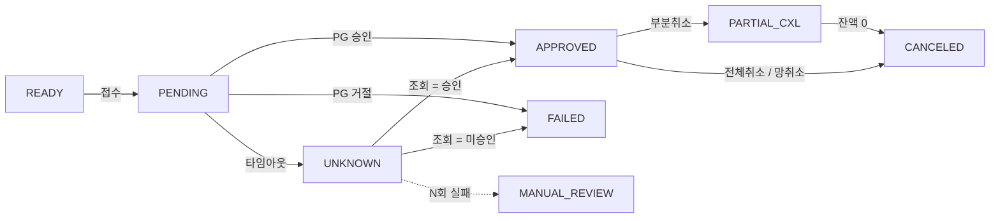

# 카프카 기반 결제 시스템 설계서

> Java 25 + Spring Boot 4 로 결제 승인 API를 만들고, 승인 이후의 모든 후속 처리를 Kafka로 분리한다.
> 이 문서의 목적은 기능 목록이 아니라 **결제에서 실제로 터지는 문제 10가지를 어떻게 막고, 막았다는 것을 어떻게 증명할지**를 먼저 정하는 것이다.

**스택** — `Java 25 LTS` `Spring Boot 4.0` `Apache Kafka 4.x (KRaft)` `PostgreSQL 17` `Redis` `Testcontainers` `Toxiproxy` `k6` `OpenTelemetry` `Grafana` `Docker Compose`

---

## 목차

| # | 장 | 내용 |
|---|---|---|
| 01 | [증명하려는 것](#01--증명하려는-것) | 네 개의 어필 축과 각각의 증명 방법 |
| 02 | [동기 / 비동기 경계](#02--동기--비동기-경계를-먼저-긋는다) | Kafka를 어디에 쓰지 **않을지** |
| 03 | [아키텍처와 모듈](#03--모듈러-모놀리스--워커-프로파일) | 모듈러 모놀리스 + 워커 프로파일 |
| 04 | [결제 상태 머신](#04--결제-상태-머신) | 상태 전이도와 전이 강제 방법 |
| 05 | [터지는 문제 10가지](#05--결제에서-실제로-터지는-문제-10가지) | **이 문서의 핵심** |
| 06 | [Kafka 설계](#06--kafka-설계) | 토픽, 파티션, 프로듀서/컨슈머 설정 |
| 07 | [데이터 모델](#07--데이터-모델) | 테이블과 제약, 인덱스 전략 |
| 08 | [성능 계획](#08--성능-계획) | 목표, 부하 시나리오, 가상 스레드 실험 |
| 09 | [관측성](#09--관측성) | 분산 추적, 대시보드 3종, 알람 |
| 10 | [테스트 전략](#10--테스트-전략) | 계층별 도구와 카오스 시나리오 |
| 11 | [구현 로드맵](#11--구현-로드맵) | Phase 0~9 |
| 12 | [MSA 전환 시나리오](#12--msa-전환-시나리오-선택-phase) | 선택 Phase |
| 13 | [클라우드 전환](#13--로컬--클라우드-전환) | 이식성 보존 규칙 |
| 14 | [예상 질문](#14--이-프로젝트를-설명할-때-나올-질문) | 면접 대비 |
| 15 | [하지 않을 것](#15--하지-않을-것) | 명시적 범위 제외 |

---

## 01 — 증명하려는 것

기능이 아니라 판단을 보여주는 문서. 네 축 모두 "구현했다"가 아니라 **숫자와 테스트로 증명했다**까지 가야 한다.

| 축 | 증명 방법 | 결과물 |
|---|---|---|
| **정합성 / 멱등성** | 같은 멱등키로 동시 100요청 → 승인 1건. 원장 차·대변 합계가 항상 0. | 동시성 테스트 + 불변식 속성 테스트 |
| **장애 대응 / 복구** | Toxiproxy로 PG 절단·지연 주입, Kafka 브로커 강제 종료. 미확정 결제가 자동 수렴하는지. | 카오스 시나리오 6종 리포트 |
| **성능 / 대용량** | k6 부하 → 병목 특정 → 튜닝 → 재측정. 가상 스레드 × 커넥션 풀 매트릭스 실험. | `PERFORMANCE.md` (before/after) |
| **관측성 / 운영** | HTTP → Kafka → Worker 까지 하나의 trace로 연결. 결제 실패율·컨슈머 lag 알람. | Grafana 대시보드 3종 |

> **이 프로젝트의 차별점은 "실패 경로"다.**
> 대부분의 포트폴리오 결제 프로젝트는 성공 경로만 있다. PG가 타임아웃 났을 때 승인됐는지 안 됐는지 모르는 상태를 어떻게 수렴시키는지가 이 문서 분량의 절반을 차지하는 이유다.

---

## 02 — 동기 / 비동기 경계를 먼저 긋는다

Kafka를 어디에 쓸지보다 **어디에 쓰지 않을지**가 먼저다. 승인 경로에 브로커를 끼워넣으면 지연만 늘고 얻는 게 없다.

### 동기 · HTTP

사용자가 응답을 기다리는 구간. 여기서 결제 성패가 확정된다.

```
멱등키 선점 → PENDING 선기록 → PG 승인 호출 → 상태 확정 + Outbox 적재 → 승인/거절 응답
```

지연 예산 — 자체 처리 40ms + PG 왕복 200ms ≈ **p99 300ms 목표**

### 비동기 · Kafka

응답 이후. 느려도 되지만 절대 유실되면 안 되는 구간.

```
Outbox Relay → payment.v1.events → ┌ 원장 기록
                                   ├ 정산 적재
                                   ├ 알림 발송
                                   ├ 집계
                                   └ 미확정 결제 복구
```

지연 예산 — 원장 반영 1초 이내, 정산·알림은 분 단위 허용

### 이 경계를 지키는 규칙 세 가지

1. **돈의 상태 변경은 동기 구간에서만 확정한다.** Kafka 컨슈머는 결제 상태를 만들지 않고, 확정된 상태를 *소비*만 한다. 예외는 미확정 결제 복구 하나뿐이고, 이건 별도 상태 전이 규칙을 따른다.
2. **동기 구간은 절대 Kafka에 직접 produce 하지 않는다.** 브로커가 죽어도 결제는 성공해야 한다. 그래서 Outbox 테이블에 같은 트랜잭션으로 쓰고 끝낸다.
3. **비동기 구간의 지연은 사용자 응답에 영향을 주지 않는다.** 원장 반영이 10초 밀려도 결제 응답은 이미 나갔다. 대신 "원장 미반영 결제 건수"를 지표로 감시한다.

---

## 03 — 모듈러 모놀리스 + 워커 프로파일

코드베이스 하나, 배포 단위 둘. 모듈 간 직접 호출을 빌드 레벨에서 막아두면 나중에 서비스 분리는 설정 변경 수준이 된다.

```
payment-system/
├─ modules/
│  ├─ payment-domain/     결제 애그리거트, 상태 머신, 금액 VO. 프레임워크 의존 0
│  ├─ payment-app/        승인/취소 유스케이스, 멱등성, Outbox 기록
│  ├─ ledger/             복식부기 원장. payment 이벤트만 구독
│  ├─ settlement/         일 단위 정산 + PG 대사(reconciliation)
│  ├─ pg-adapter/         PgClient 인터페이스 + Mock/실PG 구현
│  └─ shared-kernel/      이벤트 스키마, Money, 공통 에러
├─ apps/
│  ├─ api/                REST 엔드포인트(승인·취소). profile=api
│  └─ clearing/           매입·청산 — Kafka 리스너 + 스케줄러. profile=clearing
└─ ops/
   ├─ compose/            kafka, postgres, redis, grafana, toxiproxy
   ├─ load/               k6 시나리오
   └─ grafana/            대시보드 JSON
```

### 모듈 경계를 강제하는 방법

- Gradle 의존성 그래프로 1차 차단 — `ledger` 는 `payment-app` 을 의존하지 않는다. 통신은 `shared-kernel` 의 이벤트 레코드로만.
- **ArchUnit 테스트로 2차 차단** — 모듈 간 패키지 참조 규칙을 테스트가 깨뜨린다. 이게 있으면 "MSA 전환 가능하다"는 말에 근거가 생긴다.
- 모듈마다 DB 스키마를 분리(`payment`, `ledger`, `settlement`)하고 크로스 스키마 조인을 금지. 나중에 DB를 쪼갤 때 쿼리를 안 고쳐도 된다.

### Java 25에서 실제로 쓸 것

| 기능 | 어디에 | 얻는 것 |
|---|---|---|
| **Virtual Threads** | PG 호출 등 I/O 대기가 지배적인 승인 경로 (`spring.threads.virtual.enabled=true`) | 동시 요청당 플랫폼 스레드를 점유하지 않음 → 8장의 실험 대상 |
| **Sealed interface + Record** | 결제 상태, 도메인 이벤트, PG 응답 | switch 패턴 매칭에서 케이스 누락을 **컴파일러가** 잡음. 상태 하나 추가하면 처리 안 한 곳이 전부 빨개진다 |
| **Scoped Values** *(JDK 25 정식)* | 요청 컨텍스트(멱등키, traceId, merchantId) 전파 | 가상 스레드 환경에서 ThreadLocal 대체. 불변이라 누수·오염 없음 |
| **Structured Concurrency** *(preview)* | 승인 전 리스크 체크 + 한도 조회를 병렬로 fan-out | 하나 실패 시 나머지 자동 취소. `--enable-preview` 필요하므로 **선택 과제로 두고, 실패하면 걷어낸다** |

---

## 04 — 결제 상태 머신

모든 정합성 문제는 결국 "허용되지 않은 상태 전이가 일어났다"로 환원된다. 그래서 전이표를 코드보다 먼저 확정한다.



점선은 사람이 개입해야 하는 경로다. **모든 자동 복구가 실패했을 때 갈 곳이 있다는 것**이 설계의 일부이며, 이 경로가 없는 결제 시스템은 미확정 건을 조용히 방치한다.

### 전이 규칙 구현

전이는 서비스 코드의 `if` 가 아니라 **DB의 조건부 UPDATE** 로 강제한다. 애플리케이션 인스턴스가 여러 개여도 이게 유일한 진실이다.

```sql
UPDATE payment
   SET status = 'APPROVED', pg_tid = ?, approved_at = ?, version = version + 1
 WHERE payment_id = ?
   AND status IN ('PENDING', 'UNKNOWN')   -- 허용 출발 상태를 SQL에 박는다
   AND version = ?;
-- affected rows = 0 이면 누군가 먼저 전이시켰다는 뜻. 예외가 아니라 분기.
```

도메인 레벨에서는 sealed interface로 같은 규칙을 한 번 더 표현해서, 새 상태를 추가할 때 처리 누락을 컴파일 타임에 잡는다.

---

## 05 — 결제에서 실제로 터지는 문제 10가지

각 항목은 **시나리오 → 왜 어려운가 → 해결 → 증명 방법** 네 칸으로 쓴다.
**증명 칸이 비어 있으면 구현하지 않은 것으로 친다.**

---

### P01 — 중복 결제: 같은 요청이 두 번 들어온다

**시나리오**
사용자가 결제 버튼을 두 번 누른다. 또는 클라이언트가 응답 타임아웃 후 재요청한다. 또는 모바일 앱이 백그라운드 전환 중 재시도한다. 결과는 같다 — 같은 주문에 두 번 청구된다.

**왜 어려운가**
"이미 처리했는지 조회하고, 없으면 처리한다"는 **조회와 처리 사이에 틈이 있다.** 두 요청이 동시에 조회하면 둘 다 "없음"을 보고 둘 다 처리한다. 애플리케이션 레벨 락은 인스턴스가 늘어나면 깨진다.

**해결**
1. 클라이언트가 `Idempotency-Key` 헤더를 보낸다. 없으면 400.
2. PG 호출 *전에* `idempotency_record(key PK, request_hash, status, response_body)` 에 INSERT. **PK 충돌이 락 역할을 한다** — 애플리케이션 락 없이 DB 하나가 직렬화를 보장.
3. 충돌 시 기존 레코드를 본다. `COMPLETED` 면 저장된 응답을 그대로 리턴(같은 응답, 같은 상태 코드). `IN_PROGRESS` 면 `409 Conflict` + `Retry-After`.
4. 같은 키인데 `request_hash` 가 다르면 `422` — 키 재사용 공격/버그를 잡는다.
5. 키에 TTL(24h)을 두고 배치로 정리한다.

**증명**
같은 멱등키로 100개 스레드 동시 요청 → PG Mock 호출 횟수 정확히 1, 승인 레코드 1건, 100개 응답의 `paymentId` 가 전부 동일. `CountDownLatch` 로 시작 시점을 맞춘 통합 테스트.

---

### P02 — 미확정 결제: 승인됐는지 안 됐는지 모른다

**시나리오**
PG에 승인 요청을 보냈는데 응답 전에 소켓 타임아웃이 났다. 요청이 PG에 도달하지 못했을 수도 있고, PG는 승인했는데 응답만 유실됐을 수도 있다. **고객 카드에서 돈이 빠졌는지 우리는 모른다.** 여기서 잘못 판단하면 무료 배송 아니면 미청구 손실이다.

**왜 어려운가**
타임아웃을 실패로 간주하고 `FAILED` 처리하면 실제 승인된 건이 방치된다. 성공으로 간주하면 승인 안 된 건에 상품이 나간다. 정답은 "모른다"는 상태를 **1급 상태로 인정하고, 시간이 지나면 반드시 수렴시키는 것**이다.

**해결**
1. **PG 호출 전에 `PENDING` 을 커밋한다.** WAL과 같은 원리 — 우리가 무엇을 시도했는지의 기록이 먼저 남아야 한다. 요청 없이 응답만 유실되는 경우는 없지만, 기록 없이 요청이 나가는 경우는 얼마든지 있다.
2. 타임아웃/커넥션 에러 → `UNKNOWN` 전이 + `pg_probe_task` 등록. 사용자에게는 "확인 중"으로 응답하고 **절대 성공/실패를 단정하지 않는다.**
3. Worker가 지수 백오프(10s / 30s / 2m / 10m / 1h)로 PG 거래조회 API를 호출한다. 조회 키는 우리가 만든 `orderId` — PG가 준 TID는 못 받았으므로 **우리 키로 조회 가능한 PG만 쓴다**는 것이 어댑터 요구사항이 된다.
4. 조회 결과에 따라 `APPROVED` / `FAILED` 로 수렴. 승인이었다면 이 시점에 원장 이벤트가 발행된다(응답은 늦었지만 정합성은 맞는다).
5. 조회가 계속 실패하거나 PG가 "그런 거래 없음"을 애매하게 응답하면 **망취소(net cancel)** 를 호출한다. 있으면 취소되고 없으면 no-op — 어느 쪽이든 `CANCELED` 로 수렴한다.
6. 망취소까지 실패하면 `MANUAL_REVIEW`. 알람이 울리고 운영 화면에 뜬다. **자동화의 한계를 인정하는 것이 설계다.**

**증명**
Toxiproxy로 응답만 끊는 시나리오(요청은 도달, 응답 유실) 실행 → 결제가 `UNKNOWN` 진입 → 30초 내 `APPROVED` 수렴 확인. 요청 자체를 끊는 시나리오 → `FAILED` 수렴. Awaitility로 상태 수렴을 검증하고, 두 경우 모두 원장 잔액이 정확한지 확인.

---

### P03 — DB는 커밋됐는데 Kafka 발행이 실패한다

**시나리오**
결제를 `APPROVED` 로 커밋하고 `kafkaTemplate.send()` 를 호출하는 순간 브로커가 죽는다. 결제는 승인됐는데 원장에는 영원히 안 들어간다. 순서를 바꿔도 마찬가지 — 발행 후 DB 커밋이 실패하면 없는 결제의 이벤트가 돌아다닌다.

**왜 어려운가**
DB와 Kafka는 서로 다른 리소스라 하나의 트랜잭션으로 묶을 수 없다. XA/2PC는 성능과 운영 비용이 감당이 안 된다. `@TransactionalEventListener(AFTER_COMMIT)` 는 커밋 직후 프로세스가 죽으면 그냥 유실이다.

**해결 — Transactional Outbox**
1. 결제 상태 변경과 `outbox_event` INSERT를 **같은 DB 트랜잭션**에 넣는다. 이제 원자성은 DB 하나가 보장한다.
2. 별도 Relay가 `status='NEW'` 인 행을 `FOR UPDATE SKIP LOCKED` 로 배치 조회 → Kafka 발행 → `SENT` 마킹. `SKIP LOCKED` 덕분에 Relay 인스턴스를 여러 개 띄워도 안전하다.
3. 발행 후 마킹 전에 죽으면 재발행된다 → **Outbox는 at-least-once**. 그래서 소비 측 멱등성(P04)이 반드시 짝을 이룬다.
4. 초기엔 500ms 폴링 Relay로 시작하고, Phase 6에서 Debezium CDC로 교체해 폴링 지연과 DB 부하를 없앤 뒤 **두 방식의 지연 분포를 비교한 기록을 남긴다.**

**증명**
부하 중 `docker compose kill kafka` → 결제 API는 계속 성공(2xx 유지) 확인. 브로커 복구 후 outbox의 `NEW` 잔량이 0으로 수렴하고, 최종 원장 건수 = 승인 건수 일치.

---

### P04 — 컨슈머가 같은 이벤트를 두 번 처리한다 · 순서가 뒤집힌다

**시나리오**
원장 컨슈머가 이벤트를 처리하고 offset 커밋 전에 재기동된다 → 같은 승인이 원장에 두 번 기록되어 잔액이 두 배가 된다. 또는 `PaymentCanceled` 가 `PaymentApproved` 보다 먼저 처리되어 취소가 무시된다.

**왜 어려운가**
Kafka의 기본 보장은 at-least-once다. exactly-once(트랜잭셔널 프로듀서 + `read_committed`)는 Kafka 내부에서만 성립하고, **컨슈머가 외부 DB에 쓰는 순간 깨진다.** "Kafka가 EOS를 지원하니까 괜찮다"는 답은 면접에서 바로 파고들 지점이다.

**해결**
- **순서** — 파티션 키를 `paymentId` 로 고정한다. 같은 결제의 모든 이벤트는 같은 파티션에 들어가고 Kafka가 파티션 내 순서를 보장한다. 결제 간 순서는 애초에 의미가 없으므로 이것으로 충분하다.
- **멱등 소비** — `processed_event(event_id, consumer_group)` 복합 PK 테이블에 INSERT하는 것과 실제 처리를 **같은 트랜잭션**에 넣는다. 중복이면 PK 충돌로 롤백되고 조용히 ack.
- **상태 기반 방어** — 그것과 별개로, 원장 기록은 조건부 UPDATE/UNIQUE 제약으로 두 번 반영이 물리적으로 불가능하게 만든다. 방어선은 겹쳐야 한다.
- `enable.auto.commit=false` + 수동 ack. 처리 성공 후에만 커밋한다.

**증명**
같은 이벤트를 3회 강제 재전송 → 원장 엔트리 1건. 처리 도중 컨슈머를 `SIGKILL` → 재기동 후 중복 없이 이어서 처리. 리밸런싱 중 파티션 이동 시나리오도 동일하게 검증.

---

### P05 — 동시 취소 · 잘못된 상태 전이

**시나리오**
고객이 앱에서 취소를 누르는 동시에 CS 상담원이 어드민에서 취소를 누른다. 두 요청이 각각 PG 취소를 호출해 **이중 환불**이 발생한다. 또는 이미 취소된 결제에 취소가 한 번 더 들어온다.

**왜 어려운가**
취소는 승인보다 위험하다. 승인 중복은 멱등키로 막지만, 취소는 **서로 다른 주체가 서로 다른 경로로** 요청하므로 공유할 멱등키가 없다. 그리고 부분취소는 여러 번이 정상이라 "이미 했으니 무시"도 못 한다.

**해결**
- PG 취소 호출 *전에* 조건부 UPDATE로 **취소 권한을 선점**한다: `UPDATE payment SET cancel_lock = ? WHERE payment_id = ? AND cancel_lock IS NULL`. 진 쪽은 PG를 호출조차 하지 않는다.
- 부분취소는 `cancel_request(payment_id, request_key)` 에 UNIQUE를 걸어 요청 단위 멱등성을 준다. 어드민은 요청 키를 UI에서 생성해 전달한다.
- 금액 검증은 애플리케이션이 아니라 DB 제약으로: `canceled_amount + ? <= approved_amount` 를 WHERE 절에 넣고, 추가로 `CHECK (canceled_amount <= approved_amount)` 를 건다. 두 요청이 각각 6천원씩 취소하려 해도 승인액 1만원을 넘지 못한다.

**증명**
1만원 결제에 6천원 부분취소 2건 동시 요청 → 하나만 성공, 다른 하나는 명시적 에러. PG Mock의 취소 호출 횟수 = 1. 최종 `canceled_amount` = 6000.

---

### P06 — 원장이 안 맞는다: 복식부기 불변식

**시나리오**
결제 테이블의 상태 필드를 UPDATE하는 방식으로 잔액을 관리하면, 버그 하나가 과거를 조용히 덮어쓴다. "어제까지는 맞았는데 오늘 안 맞는다"가 되고 **언제 무엇 때문에 틀어졌는지 추적할 방법이 없다.**

**왜 어려운가**
돈은 현재 값이 아니라 변동 이력이 진실이다. 그런데 조회 성능 때문에 잔액 스냅샷도 필요하다. 둘이 어긋나는 순간을 잡아내는 장치가 없으면 스냅샷을 신뢰할 수 없다.

**해결**
- `ledger_entry` 는 **append-only**. UPDATE/DELETE 권한을 애플리케이션 DB 계정에서 아예 회수한다.
- 모든 거래는 최소 2개 엔트리(차변/대변)로 기록하고 `transaction_group_id` 로 묶는다. 승인이면 `고객미수 +10,000 / 매출 -10,000`.
- **불변식: 임의 시점에 모든 엔트리 금액의 총합은 0.** 이게 깨지면 어딘가에서 돈이 생기거나 사라진 것이다.
- 잔액 스냅샷은 파생 데이터로만 취급한다. 일 배치가 엔트리를 재집계해 스냅샷과 대조하고, 불일치를 알람으로 올린다.
- 금액은 `BigDecimal` 도 아닌 **`long` 최소 화폐 단위**(원)로 저장하고 통화 코드를 함께 둔다. 부동소수점은 결제에서 논외.

**증명**
속성 기반 테스트 — 랜덤한 승인/부분취소/전체취소 시퀀스 1,000개를 생성해 적용한 뒤 `SUM(amount) = 0` 검증. 어떤 순열에서도 깨지지 않아야 한다.

---

### P07 — PG와 우리 장부가 다르다: 대사(reconciliation)

**시나리오**
P02의 자동 수렴을 다 돌려도, 다음 날 PG 거래내역과 우리 원장을 맞춰보면 어긋난 건이 남는다. PG 쪽에서 자체 취소했거나, 우리가 놓친 응답이 있거나, 금액이 미세하게 다르다(수수료·할부 처리).

**왜 어려운가**
실시간 정합성은 최선을 다하는 것이고, **진짜 보증은 사후 대사에서 나온다.** 이게 없으면 시스템은 자기가 틀렸다는 사실 자체를 모른다. 대부분의 토이 프로젝트가 여기까지 안 간다.

**해결**
- Mock PG가 매일 **거래내역 파일(CSV)** 을 떨군다. 실제 PG의 정산 파일과 같은 형태로.
- 대사 배치가 `(orderId, amount, status)` 로 조인해 세 종류의 불일치를 분류: `우리만 있음`(PG 미승인인데 승인 처리) / `PG만 있음`(우리가 놓친 승인) / `금액 불일치`
- 결과를 `reconciliation_result` 에 남기고 대시보드에 노출. 불일치 0건인 날이 정상이고, 1건이라도 있으면 알람.
- 자동 교정은 **하지 않는다**. 대사 불일치는 사람이 판단할 영역이라는 게 이 설계의 입장이고, 그 이유를 문서에 남긴다.

**증명**
Mock PG가 의도적으로 3건을 누락하고 1건의 금액을 바꾼 파일을 생성 → 대사 배치가 정확히 4건을 유형별로 잡아내는지 검증.

---

### P08 — 재시도 폭풍: 장애가 장애를 키운다

**시나리오**
PG가 느려진다 → 요청이 쌓인다 → 타임아웃이 난다 → 전부 재시도한다 → PG에 가는 부하가 2배가 된다 → 완전히 죽는다. 우리 쪽은 스레드와 커넥션이 대기로 가득 차 **PG와 무관한 조회 API까지 같이 죽는다.**

**왜 어려운가**
재시도는 개별적으로는 옳은 선택인데 합쳐지면 공격이 된다. 그리고 가상 스레드를 쓰면 스레드가 안 마르기 때문에 **요청이 무한정 쌓이는 방향으로 문제가 옮겨간다** — 스레드 풀이 자연스러운 백프레셔 역할을 하던 걸 잃는다.

**해결**
- **서킷 브레이커**(Resilience4j) — PG 어댑터에 적용. OPEN이면 즉시 실패시켜 사용자에게 빠르게 알린다. 5초 기다렸다 실패하는 것보다 즉시 실패가 낫다.
- **Bulkhead** — PG 호출 동시성을 명시적으로 제한한다. 가상 스레드가 백프레셔를 없앴으므로 세마포어로 직접 만든다. **이 항목이 8장의 가상 스레드 실험과 직결된다.**
- **지터 있는 지수 백오프** — 고정 간격 재시도는 재시도를 동기화시켜 파도를 만든다.
- **승인은 자동 재시도하지 않는다** — 결과가 불확실한 요청의 재시도는 P02의 미확정 상태를 늘릴 뿐이다. 조회·취소만 재시도 대상.
- Kafka 컨슈머는 `@RetryableTopic` 으로 논블로킹 재시도 계층(`retry.5s → retry.1m → retry.10m`) 구성 후 DLQ. 블로킹 재시도는 파티션 전체를 멈춘다.

**증명**
PG 응답을 3초로 지연시킨 상태에서 부하 → 서킷이 열리는 시점과 조회 API의 p99를 함께 측정. Bulkhead 유/무 비교에서 조회 API가 영향받지 않는 것을 그래프로 보인다.

---

### P09 — DLQ에 쌓인 이벤트를 아무도 안 본다

**시나리오**
원장 컨슈머가 특정 이벤트에서 계속 실패해 DLQ로 간다. 승인은 났는데 원장에는 없는 상태로 **몇 주가 지난다.** DLQ를 만들어놓고 소비하지 않으면 그냥 잘 정리된 유실이다.

**왜 어려운가**
재처리는 순서를 깨뜨린다. DLQ에 간 `PaymentApproved` 를 나중에 재처리하면, 그 사이 처리된 `PaymentCanceled` 보다 뒤에 적용된다. 그냥 다시 넣으면 안 된다.

**해결**
- DLQ 메시지 수를 **대시보드 최상단 지표**로 올리고, 1건이라도 있으면 알람. 0이 정상이다.
- DLQ 조회/재처리 어드민 API를 만든다: 원본 메시지 + 실패 원인 스택 + 재시도 이력 조회, 선택 재처리, 폐기(사유 필수).
- 재처리는 원본 토픽으로 되돌리는 게 아니라 **상태 기반 재조정**으로 한다. "이 결제의 원장 상태를 결제 테이블 기준으로 다시 맞춰라" — 순서에 의존하지 않는 멱등 연산이라 언제 실행해도 안전하다.
- 이 재조정 로직은 P07 대사와 같은 코드를 쓴다. 실시간 복구와 사후 대사가 같은 진실을 참조해야 서로 싸우지 않는다.

**증명**
원장 컨슈머가 특정 결제에서 예외를 던지도록 주입 → 재시도 계층을 거쳐 DLQ 도달 → 알람 발생 확인 → 어드민 API로 재조정 실행 → 원장 정합 회복. 그 사이 취소가 발생한 케이스에서도 최종 상태가 옳은지 확인.

---

### P10 — 이벤트 스키마를 바꿔야 한다

**시나리오**
`PaymentApproved` 에 할부 개월 수를 추가한다. 프로듀서를 먼저 배포하면 구버전 컨슈머가 역직렬화에 실패하고, 컨슈머를 먼저 배포하면 새 필드가 없어 NPE가 난다. 토픽에는 이미 **구버전 메시지가 7일치 남아 있다.**

**왜 어려운가**
Kafka는 로그다. 배포로 과거를 지울 수 없고, 리플레이하면 옛날 포맷이 그대로 다시 흐른다. HTTP API의 버저닝과 근본적으로 다른 문제다.

**해결**
- 모든 이벤트에 `eventId`, `eventType`, `schemaVersion`, `occurredAt`, `traceId` 를 envelope으로 강제한다.
- **하위 호환 규칙**: 필드 추가는 기본값과 함께만, 삭제·타입 변경·의미 변경은 금지. 필요하면 새 필드를 추가하고 구필드를 deprecated로 둔다.
- 깨는 변경은 `payment.v2.events` 새 토픽으로. 전환 기간에는 양쪽에 발행하고 컨슈머를 하나씩 옮긴다.
- 토픽 이름에 버전을 넣는 이유가 이것이다 — `payment.v1.events`.
- 선택 확장: Avro + Schema Registry에 `BACKWARD` 호환성 강제. 규칙을 문서가 아니라 **CI가** 지키게 만드는 것이 핵심이고, 최소한 스키마 호환성 검사 테스트라도 CI에 넣는다.

**증명**
구버전 스키마로 직렬화한 메시지를 신버전 컨슈머가 정상 처리하고, 그 반대도 성립하는 계약 테스트. CI에서 스키마 변경 시 호환성 검사가 실패로 막는 것까지 확인.

---

## 06 — Kafka 설계

### 토픽

| 토픽 | 키 | 파티션 | 보존 | 용도 |
|---|---|---:|---:|---|
| `payment.v1.events` | paymentId | 12 | 7d | 승인·실패·취소 사실 이벤트. 모든 다운스트림의 원천 |
| `payment.v1.events.retry.{5s,1m,10m}` | paymentId | 6 | 3d | 논블로킹 재시도 계층 |
| `payment.v1.events.dlq` | paymentId | 3 | 30d | 최종 실패. **0건이 정상** |
| `payment.v1.probe-tasks` | paymentId | 6 | 7d | 미확정 결제 상태 조회 지시 |
| `settlement.v1.tasks` | merchantId | 6 | 7d | 정산 대상 적재 |
| `notification.v1.tasks` | userId | 6 | 1d | 알림. 유실 허용 등급이 다름을 명시 |

파티션 12는 로컬 기준 과할 수 있지만, **파티션은 늘리면 기존 키의 분배가 바뀌어 순서 보장이 깨지므로** 처음부터 여유 있게 잡는다. 컨슈머 인스턴스를 3개까지 늘려도 균등 분배되는 수(12 = 3×4)로 선택했다.

### 프로듀서 / 컨슈머 설정과 이유

```properties
# Producer (Outbox Relay 전용)
acks=all                      # 리더만 받고 죽으면 유실. 결제에서 허용 불가
enable.idempotence=true       # 브로커 재시도로 인한 중복 발행 방지
max.in.flight.requests.per.connection=5   # 멱등 프로듀서에서 순서 보장되는 상한
retries=2147483647
delivery.timeout.ms=120000    # 이 시간까지 못 보내면 Outbox에 NEW로 남는다 = 안전

# Consumer
enable.auto.commit=false      # 처리 성공 후에만 커밋
isolation.level=read_committed
max.poll.records=100          # 처리 시간 × 100 < max.poll.interval.ms 유지
max.poll.interval.ms=300000
auto.offset.reset=earliest    # 결제 이벤트를 건너뛰는 일은 없어야 한다
```

> **왜 Kafka Streams / EOS를 안 쓰는가.**
> 트랜잭셔널 프로듀서의 exactly-once는 Kafka 토픽 간에만 성립한다. 우리 컨슈머는 PostgreSQL에 쓰기 때문에 그 보장 밖이다.
> 그래서 처음부터 **at-least-once + 소비 측 멱등**으로 설계하고, EOS를 안 쓰는 이유를 문서에 남긴다. 이 판단 자체가 어필 포인트다.

---

## 07 — 데이터 모델

Flyway로 관리. 각 테이블의 존재 이유가 5장의 문제 번호와 1:1로 대응한다.

| 테이블 | 핵심 제약 | 대응 |
|---|---|---|
| `payment` | PK `payment_id`, UQ `(merchant_id, order_id)`, `version` 낙관적 락, CHECK `canceled_amount <= approved_amount` | P01 P05 |
| `payment_history` | append-only 상태 전이 이력 (from, to, reason, actor, at) | P02 P05 |
| `idempotency_record` | PK `key`, `request_hash`, `response_body`, TTL | P01 |
| `outbox_event` | `status`+`created_at` 부분 인덱스(`WHERE status='NEW'`) | P03 |
| `processed_event` | PK `(event_id, consumer_group)` | P04 |
| `ledger_entry` | append-only, UQ `(source_event_id, account)`, `amount BIGINT` | P06 |
| `pg_probe_task` | `next_attempt_at` 인덱스, `attempt_count` | P02 |
| `reconciliation_result` | `(settle_date, mismatch_type)` | P07 |

### 인덱스와 파티셔닝

- `payment` 는 `created_at` 기준 월별 **선언적 파티셔닝**. 결제 조회는 대부분 최근 데이터라 오래된 파티션이 인덱스에서 빠지는 것만으로 성능이 유지된다.
- 조회 패턴이 확정되기 전에 인덱스를 미리 만들지 않는다. **8장의 부하 테스트에서 실제 느린 쿼리를 `pg_stat_statements` 로 잡고 그때 추가한 뒤, 추가 전후를 기록한다.** 이 과정 자체가 결과물이다.
- `outbox_event` 는 `SENT` 행을 배치로 삭제한다. 안 지우면 부분 인덱스가 커지면서 Relay 폴링이 느려진다.

---

## 08 — 성능 계획

숫자 자체보다 **병목을 어떻게 찾았고 무엇을 바꿔 얼마나 좋아졌는지의 기록**이 결과물이다. 튜닝 없이 나온 첫 숫자도 반드시 남긴다.

### 목표 (로컬 단일 노드 기준)

| 지표 | 1차 목표 | 튜닝 후 목표 | 측정 |
|---|---:|---:|---|
| 승인 API 처리량 | 300 TPS | 1,000 TPS | k6 constant-arrival |
| 승인 API p99 (PG 100ms 고정) | < 500 ms | < 300 ms | k6 + OTel span |
| 승인 → 원장 반영 지연 p99 | < 3 s | < 1 s | 이벤트 타임스탬프 차 |
| 컨슈머 lag (정상 부하) | < 1,000 | < 100 | Kafka exporter |
| 오류율 | 0 % | 0 % | 5xx + 미확정 잔량 |

### 부하 시나리오 (k6)

1. **Baseline** — 목표 TPS 정상 부하 10분. 이게 기준선이다.
2. **Spike** — 30초간 5배. 회복 시간과 그 사이 오류율을 본다.
3. **Slow PG** — PG 응답을 500ms / 3s로 지연. 서킷과 Bulkhead 동작 확인.
4. **Flaky PG** — 10% 타임아웃 주입. 미확정 결제가 얼마나 쌓이고 얼마 만에 수렴하는지.
5. **Hot merchant** — 전체 트래픽의 80%가 한 가맹점에. 파티션 편중과 로우 레벨 락 경합 관찰.
6. **Broker down** — 부하 중 브로커 종료 후 복구. API 성공률 유지 + Outbox 적체 해소 시간.

### 예상 병목과 대응 축

| 병목 | 증상 | 대응 |
|---|---|---|
| **DB 커넥션 풀** | TPS는 안 오르는데 p99만 계단식으로 상승. Hikari `pending` 지표 상승 | 풀 크기 조정, PG 호출 구간에서 커넥션 **미보유** 하도록 트랜잭션 경계 재설계 |
| **트랜잭션 범위** | 외부 호출이 트랜잭션 안에 들어가 커넥션을 200ms씩 잡음 | PG 호출을 트랜잭션 밖으로. 상태 기록 트랜잭션을 **호출 전/후 두 개**로 분리 — P02의 설계와 정확히 일치한다 |
| **Outbox 폴링 지연** | 원장 반영 p99가 폴링 주기에 붙어서 고정 | 주기·배치 크기 튜닝 → 그래도 부족하면 Debezium CDC |
| **파티션 편중** | 특정 파티션만 lag 증가 | 키 설계 재검토, 순서가 필요 없는 토픽은 키 제거 |
| **로우 락 경합** | 같은 가맹점 UPDATE 대기 | 가맹점 집계는 원장에서 배치 파생으로 빼고 핫 로우를 없앤다 |

### 가상 스레드 실험 — 이 프로젝트의 핵심 측정

"Java 25 가상 스레드 썼습니다"는 아무것도 증명하지 않는다. 증명해야 하는 건 **가상 스레드가 병목을 옮겼을 뿐 없애지 않았다**는 사실을 직접 측정했다는 것이다.

| 조건 | 변수 | 가설 |
|---|---|---|
| A. 플랫폼 스레드 200 | Hikari 20 / 50 / 100 | 스레드 수에서 처리량 상한이 걸린다 |
| B. 가상 스레드 | Hikari 20 / 50 / 100 | 스레드 상한은 사라지지만 **커넥션 풀이 새 상한**이 된다 |
| C. 가상 스레드 + Bulkhead | 동시 PG 호출 100 / 300 | 상한이 명시적으로 통제되고 지연 분포가 안정된다 |

JDK 24의 JEP 491로 `synchronized` 로 인한 캐리어 스레드 핀닝은 해소됐다. 따라서 **남은 병목은 스레드가 아니라 커넥션과 DB**이고, B 조건에서 그 전환점을 그래프로 보이는 것이 목표다. 핀닝이 문제라고 답하는 것과 이걸 구분해서 답하는 것의 차이가 크다.

모든 결과는 `PERFORMANCE.md` 에 **측정 환경 / 변경 내용 / before / after / 해석** 다섯 칸으로 기록한다. **실패한 튜닝(효과 없었던 것)도 남긴다.**

---

## 09 — 관측성

### 분산 추적

OpenTelemetry로 **HTTP 요청 → DB → Outbox → Kafka → Worker → 원장 기록**까지 하나의 trace로 연결한다. 핵심은 Kafka 구간의 컨텍스트 전파 — 프로듀서가 메시지 헤더에 traceparent를 심고 컨슈머가 복원한다. Spring Kafka + OTel 자동 계측이 처리하지만, Outbox를 거치면 **발행이 원래 트랜잭션과 다른 스레드·다른 시점에 일어나므로** traceId를 `outbox_event` 컬럼에 저장해 직접 이어붙여야 한다. 이 디테일이 "Outbox를 실제로 만들어봤는가"를 가른다.

### 대시보드 3종

| 대시보드 | 보는 사람 | 핵심 지표 |
|---|---|---|
| **결제 현황** | 비즈니스 | 분당 승인 건수·금액, 승인 성공률, PG별 응답시간, 취소율 |
| **시스템 건전성** | 운영 | API p50/p95/p99, 컨슈머 lag, Outbox NEW 잔량, Hikari active/pending, 서킷 상태 |
| **정합성** | 운영 / 재무 | UNKNOWN 잔량 · DLQ 건수 · MANUAL_REVIEW 건수 · 대사 불일치 · 원장 총합(0이어야 함) |

> **정합성 대시보드의 네 지표는 전부 "0이 정상"이다.**
> 0이 아니면 돈이 어긋나 있다는 뜻이므로 전부 알람 대상이다. 지표를 이렇게 설계했다는 것 자체가 결제 도메인을 이해했다는 신호다.

### 알람

- **P1 (즉시)** — DLQ ≥ 1 · MANUAL_REVIEW ≥ 1 · 원장 총합 ≠ 0 · 대사 불일치 ≥ 1
- **P2** — 승인 성공률 5분 이동평균 < 95% · UNKNOWN 잔량 10분 이상 미해소 · 컨슈머 lag > 10,000
- **P3** — p99 목표 초과 · Outbox NEW 잔량 증가 추세

---

## 10 — 테스트 전략

5장의 "증명" 칸을 실제 테스트로 옮긴 것. **테스트 목록이 곧 이 프로젝트의 주장 목록이다.**

| 계층 | 도구 | 무엇을 잡는가 |
|---|---|---|
| **도메인 단위** | JUnit 5 | 상태 전이 규칙 전수. sealed + switch로 케이스 누락은 컴파일러가 먼저 잡는다 |
| **불변식 속성** | jqwik | 랜덤 승인/취소 시퀀스 1,000개 후에도 원장 총합 = 0, `canceled ≤ approved` |
| **통합** | Testcontainers (Postgres + Kafka) | Outbox → Kafka → 컨슈머 → 원장 전체 경로. **임베디드 Kafka 대신 실제 브로커**를 쓰는 이유는 리밸런싱·offset 동작을 재현하기 위해서다 |
| **동시성** | CountDownLatch + Awaitility | 동시 멱등키, 동시 취소, 동시 부분취소 (P01 P05) |
| **카오스** | Toxiproxy | PG 지연·절단·응답만 유실, 브로커 종료, 컨슈머 SIGKILL (P02 P03 P04) |
| **계약** | 직렬화 왕복 테스트 | 이벤트 스키마 상·하위 호환 (P10) |
| **부하** | k6 | 8장의 시나리오 6종 |

### 카오스 시나리오 6종 (별도 리포트로 남길 것)

1. PG 응답 유실 → `UNKNOWN` → 조회로 `APPROVED` 수렴
2. PG 요청 자체 차단 → `UNKNOWN` → 조회로 `FAILED` 수렴
3. PG 조회까지 계속 실패 → 망취소 → `CANCELED` 수렴
4. 전부 실패 → `MANUAL_REVIEW` + 알람 발생
5. 브로커 종료 중 결제 진행 → API 성공 유지 → 복구 후 Outbox 자동 해소
6. 컨슈머 처리 중 SIGKILL → 재기동 후 중복 없이 재개

각 시나리오는 **스크립트 한 줄로 재현 가능**해야 한다. README에 명령어를 적어두면 리뷰어가 직접 돌려볼 수 있고, 이게 이 프로젝트에서 가장 강한 인상을 남기는 부분이다.

---

## 11 — 구현 로드맵

주말·평일 저녁 기준 Phase 0~8이 10주, 선택 Phase 9가 +2주.
각 Phase는 **동작하는 것 + 그것을 증명하는 테스트**가 모두 있어야 완료다.

### Phase 0 — 스캐폴딩과 Mock PG *(1주)*
- Gradle 멀티모듈 + ArchUnit 경계 테스트
- docker compose: Postgres, Kafka(KRaft), Redis
- **Mock PG 서버** — 승인/취소/조회 API + 지연·실패율·응답유실을 런타임에 주입하는 제어 엔드포인트

> 완료 기준 — `docker compose up` 후 헬스체크 전부 통과

### Phase 1 — 동기 승인 + 멱등성 *(1.5주)*
- 결제 도메인, 상태 머신, 조건부 UPDATE 전이
- 멱등키 처리 (P01), `PENDING` 선기록
- 승인/조회 REST API

> 완료 기준 — 동시 100요청 테스트 통과 (P01 증명)

### Phase 2 — Outbox + Kafka *(1주)*
- `outbox_event` + `SKIP LOCKED` Relay
- 토픽 생성, 프로듀서 설정, 이벤트 envelope
- 원장 컨슈머 + `processed_event` 멱등 소비

> 완료 기준 — 브로커 종료 중 결제 성공 + 복구 후 자동 해소 (P03 P04 증명)

### Phase 3 — 원장과 취소 *(1주)*
- 복식부기 `ledger_entry`, append-only 강제
- 전체/부분 취소, 취소 락, 금액 제약
- 불변식 속성 테스트

> 완료 기준 — 랜덤 시퀀스 1,000회 후 총합 0 (P05 P06 증명)

### Phase 4 — 장애 복구: 이 프로젝트의 심장 *(1.5주)*
- `UNKNOWN` 상태, probe task, 지수 백오프 조회
- 망취소, `MANUAL_REVIEW` 큐
- 재시도 토픽 계층 + DLQ + 재조정 어드민 API
- 서킷 브레이커, Bulkhead

> 완료 기준 — 카오스 시나리오 6종 전부 통과 (P02 P08 P09 증명)

### Phase 5 — 정산과 대사 *(1주)*
- 일 단위 정산 배치
- Mock PG 거래내역 파일 생성 + 대사 배치
- 불일치 3유형 분류 및 리포트

> 완료 기준 — 의도적으로 심은 4건의 불일치를 유형별로 정확히 검출 (P07 증명)

### Phase 6 — 관측성 *(1주)*
- OTel 계측, Outbox 구간 traceId 이어붙이기
- Grafana 대시보드 3종 + 알람 룰
- 구조화 로깅(JSON) + traceId 상관

> 완료 기준 — 결제 1건의 전체 여정이 하나의 trace로 조회됨

### Phase 7 — 성능 측정과 튜닝 *(1.5주)*
- k6 시나리오 6종 실행 → 기준선 기록
- 가상 스레드 × 커넥션 풀 매트릭스 실험
- 병목 특정 → 튜닝 → 재측정 → `PERFORMANCE.md`

> 완료 기준 — before/after 그래프와 해석이 담긴 문서

### Phase 8 — 포장 *(0.5주)*
- README — 5분 안에 돌려볼 수 있는 실행 가이드, 카오스 시나리오 재현 명령어
- ADR 문서 — "왜 승인 경로에 Kafka를 안 썼는가", "왜 EOS를 안 쓰는가", "왜 대사를 자동 교정하지 않는가"
- 아키텍처 다이어그램, 상태 전이도

> 완료 기준 — 처음 보는 사람이 README만으로 카오스 시나리오를 재현

### Phase 9 — MSA 전환 *(+2주 · 선택, 12장 참조)*
- `ledger` 를 독립 서비스로 추출, DB 스키마 분리
- 전환 전후 동일 부하 시나리오 비교 측정
- `MIGRATION.md` — 무엇이 깨졌고 대가가 얼마였는지

> 착수 조건 — Phase 4·6·7 완료. **하나라도 미완이면 착수하지 않는다**

> **일정이 밀리면 Phase 9 → Phase 5 순으로 자른다.**
> Phase 4를 자르면 이 프로젝트가 다른 결제 토이 프로젝트와 구분되지 않는다. Phase 7도 자르면 안 된다 — 어필 축 4개 중 2개가 거기서 나온다.

---

## 12 — MSA 전환 시나리오 (선택 Phase)

목표는 "MSA로 전환했다"가 아니다. **전환의 비용이 얼마였는지를 숫자로 말할 수 있는 것**이 목표다. 그건 대부분의 지원자가 못 하는 답이다.

> **왜 "전환했다"는 어필이 약한가.**
> 3장의 설계대로면 모듈은 이미 이벤트로만 통신하고 스키마도 분리돼 있다. 추출 자체는 어렵지 않다 — 즉 그 사실만으로는 증명되는 게 없다.
> 값이 나오는 지점은 전환 이후다: 무엇이 실제로 깨졌고, 지연이 얼마나 늘었고, 운영 부담이 얼마나 커졌는가.

### 착수 조건

아래 셋이 모두 끝난 뒤에만 시작한다. 하나라도 미완인 상태로 전환하면 **덜 만든 프로젝트가 두 개**가 될 뿐이다.

- **Phase 4 (장애 복구)** — 미확정 결제 수렴이 없는 상태에서 프로세스 경계를 늘리면 실패 지점만 늘어난다.
- **Phase 6 (관측성)** — 분산 추적 없이 두 서비스를 디버깅하는 건 불가능하다. 전환의 선행조건임을 이 순서로 증명한다.
- **Phase 7 (성능 기준선)** — 비교 대상이 없으면 전환 비용을 측정할 수 없다.

### 대상: `ledger` 하나만

전부 쪼개는 건 같은 교훈의 반복이라 분량만 늘어난다. `ledger` 를 고른 이유는 세 가지다.

- 이미 이벤트만 소비하고 결제 상태를 변경하지 않는다 → **도메인 경계가 실제로 존재**한다.
- 그럼에도 조회 경로에서는 `payment` 와 조인이 필요하다 → **DB 분리의 진짜 통증**이 나온다.
- 돈을 다루는 모듈이라 정합성 실패가 즉시 드러난다 → 전환이 잘못됐는지 바로 알 수 있다.

`settlement` 는 배치라 네트워크 경계를 넘어도 아프지 않고, `payment` 자체를 쪼개는 것은 실무에서도 하지 않는 선택이라 둘 다 제외한다.

### 전환하면 실제로 깨지는 것들

| 깨지는 것 | 왜 | 대응 · 남길 기록 |
|---|---|---|
| **조인이 사라진다** | "결제 + 원장 내역" 조회가 한 쿼리에서 두 서비스 호출로 바뀐다. 목록 조회에서 즉시 N+1 | 원장 서비스가 결제 요약을 **읽기 모델로 복제**해서 보유한다. 정규화를 포기하는 결정이므로 그 이유와 데이터 신선도(이벤트 지연 = 최대 1초)를 문서에 남긴다 |
| **로컬 트랜잭션이 사라진다** | 결제 상태와 원장 기록을 한 트랜잭션에 묶을 수 없다 | 이미 Outbox + 멱등 소비로 커버돼 있음을 **확인**한다. 이 항목이 아프지 않다는 것 자체가 P03·P04 설계가 옳았다는 증거다 |
| **이벤트 스키마가 진짜 계약이 된다** | 같은 코드베이스일 땐 컴파일러가 잡아주던 것을 이제 아무도 안 잡는다. 배포 순서가 문제가 된다 | P10의 호환성 검사를 **CI 필수 게이트**로 승격. 여기서 처음으로 Schema Registry가 값을 한다 |
| **장애 격리가 필요해진다** | 원장 서비스가 죽어도 결제는 받아야 한다 | 결제 → 원장은 이미 비동기라 무영향. 대신 **조회 경로**에 서킷 브레이커와 폴백(원장 부분만 비어서 응답) 추가 |
| **디버깅 난이도** | 한 요청이 두 프로세스·두 DB에 걸친다 | traceId 하나로 전 구간 추적되는지 재검증. **Phase 6이 없었으면 여기서 막혔다**는 것을 기록 |
| **테스트가 무거워진다** | 통합 테스트가 컨테이너 2개 → 4개 | 계약 테스트로 대체 가능한 범위를 나눈다. 전체 테스트 실행 시간을 전후 비교 |

### 측정할 것 — 이게 결과물이다

같은 k6 시나리오(8장의 Baseline · Spike · Slow PG)를 모놀리스와 MSA 양쪽에 돌려 아래를 표로 채운다.
정직하게 채우면 **대부분의 칸에서 MSA가 진다**. 그게 이 실험의 핵심이다.

| 지표 | 모놀리스 | MSA | 해석 |
|---|---:|---:|---|
| 승인 API p99 | — | — | 승인 경로는 원장과 무관하므로 **차이가 없어야 정상**. 차이가 나면 경계를 잘못 그은 것 |
| 결제+원장 조회 p99 | — | — | 네트워크 홉 추가 비용. 읽기 모델 복제 전후를 각각 측정 |
| 승인 → 원장 반영 지연 | — | — | 이미 비동기라 차이가 작아야 한다 |
| 로컬 전체 기동 시간 | — | — | 개발 생산성의 실제 비용 |
| 전체 테스트 실행 시간 | — | — | 피드백 루프가 얼마나 느려졌는가 |
| 컨테이너 / 설정 파일 수 | — | — | 운영 표면적 |
| 장애 격리도 | — | — | 원장 서비스 강제 종료 시 결제 성공률. **여기서만 MSA가 이긴다** |

### 전환 순서 (스트랭글러)

1. `ledger` 스키마를 별도 DB 인스턴스로 이관. **코드는 그대로** 두고 커넥션만 분리 — 여기서 크로스 스키마 조인이 남아 있으면 컴파일이 깨지고, 3장의 경계 규칙이 지켜졌는지 검증된다.
2. 조회 경로가 요구하는 결제 요약을 원장 쪽 읽기 모델로 복제. 기존 조인 제거.
3. `apps/ledger-service` 를 추가하고 기존 워커에서 원장 컨슈머를 제거. 배포 단위 분리.
4. 동일 부하 시나리오 재실행 → 표 채우기.
5. `MIGRATION.md` 작성 — 각 단계에서 무엇이 깨졌고 어떻게 알았는지. **실패한 시도도 남긴다.**

> **이 Phase의 결론이 "전환하지 말았어야 했다"여도 성공이다.**
> "이 규모에서는 모듈러 모놀리스가 옳았고, 서비스 분리가 정당화되는 조건은 X와 Y다"라고 근거를 들어 말할 수 있으면
> MSA를 무비판적으로 쪼갠 프로젝트보다 훨씬 강하다. 그 결론을 ADR로 남긴다.

---

## 13 — 로컬 → 클라우드 전환

지금은 compose로 간다. 나중에 AWS로 옮길 때 **애플리케이션 코드는 한 줄도 안 바뀌게** 하는 것이 조건이다.

| 구성요소 | 로컬 (지금) | AWS (나중) | 코드 변경 |
|---|---|---|---|
| Kafka | compose · KRaft | MSK (KRaft) | **없음** — 부트스트랩 주소 + IAM 인증 설정만 |
| PostgreSQL | compose | RDS / Aurora | **없음** — JDBC URL만 |
| Redis | compose | ElastiCache | **없음** |
| 앱 실행 | compose 2 프로세스 | ECS Fargate 2 서비스 | **없음** — 프로파일 그대로 |
| 관측 | Grafana + Prometheus | AMP / Grafana Cloud | **없음** — OTel exporter 주소만 |
| 스키마 | Flyway | Flyway (배포 파이프라인) | **없음** |

### 지금부터 지킬 규칙 (전환 가능성을 보존하는 것들)

- 브로커·DB·Redis 주소, 자격증명은 **전부 환경변수**. 코드와 `application.yml` 에 호스트명 하드코딩 금지.
- 로컬 파일시스템 의존 금지. 대사 파일도 추상화된 스토리지 인터페이스로 읽는다(로컬 구현 / S3 구현).
- 인메모리 세션·인메모리 스케줄러 상태 금지. 인스턴스는 언제든 죽고 늘어난다고 가정한다.
- 스케줄러(probe, 정산 배치)는 **다중 인스턴스에서 중복 실행돼도 안전**하게 만든다. `SKIP LOCKED` 나 DB 기반 리더 선출로. 이게 없으면 스케일아웃 순간 결제가 두 번 조회된다.
- Kafka는 처음부터 KRaft. ZooKeeper 기반으로 만들면 Kafka 4.x·MSK 최신 버전과 어긋난다.

여기까지 지키면 전환은 `ops/` 디렉토리 교체 작업이 된다. 실제로 배포까지 갈지는 나중에 정하되, **"전환 가능하게 설계했고 그 근거는 이것"** 이라고 말할 수 있는 상태가 이 단계의 목표다.

---

## 14 — 이 프로젝트를 설명할 때 나올 질문

면접에서 반드시 들어올 질문들. **답이 준비 안 된 항목이 있으면 그 부분의 설계가 아직 안 끝난 것이다.**

**Q. 결제 승인에 왜 Kafka를 안 썼나요?**
사용자가 응답을 기다리는 구간이라 동기여야 합니다. Kafka를 끼우면 "접수됨"까지밖에 응답 못 하고, 최종 결과를 폴링이나 웹소켓으로 다시 전달해야 해서 복잡도만 늘어납니다. Kafka는 승인 확정 이후의 팬아웃 — 원장·정산·알림·복구 — 에서 값을 냅니다.

**Q. PG 호출이 타임아웃 나면 어떻게 하나요?**
실패로 단정하지 않습니다. 호출 전에 `PENDING` 을 커밋해두고, 타임아웃이면 `UNKNOWN` 으로 전이한 뒤 지수 백오프로 PG 거래조회를 반복합니다. 조회로 수렴 안 되면 망취소를 호출하고, 그것도 실패하면 `MANUAL_REVIEW` 로 보내 알람을 울립니다. 자동 복구의 한계를 인정하는 경로가 있는 게 핵심입니다.

**Q. Kafka의 exactly-once를 쓰면 중복 처리 문제가 해결되지 않나요?**
트랜잭셔널 프로듀서의 EOS는 Kafka 토픽 간에만 성립합니다. 제 컨슈머는 PostgreSQL에 쓰기 때문에 그 보장 밖입니다. 그래서 at-least-once를 전제하고 `processed_event` 테이블 삽입을 처리와 같은 트랜잭션에 넣어 소비 측에서 멱등성을 확보했습니다.

**Q. Outbox 대신 `@TransactionalEventListener(AFTER_COMMIT)` 로 하면 안 되나요?**
커밋 직후 프로세스가 죽으면 이벤트가 그냥 유실됩니다. 결제 승인이 원장에 안 들어가는 경우라 허용할 수 없습니다. Outbox는 DB에 기록이 남아 있어 Relay가 언제든 다시 집어갑니다. 대신 재발행 가능성이 생기므로 소비 측 멱등성이 짝으로 필요합니다.

**Q. 가상 스레드를 쓰니 성능이 얼마나 좋아졌나요?**
스레드 수 상한은 사라졌지만 처리량은 기대만큼 안 올랐고, 병목이 DB 커넥션 풀로 옮겨간 것을 측정으로 확인했습니다. JDK 24 이후 `synchronized` 핀닝은 해소돼서 문제가 아니었고, 실제 상한은 커넥션 수와 트랜잭션 범위였습니다. PG 호출을 트랜잭션 밖으로 빼고 Bulkhead로 동시성을 명시적으로 제한한 뒤 수치가 정리됐습니다. 자세한 매트릭스는 `PERFORMANCE.md` 에 있습니다.

**Q. 트래픽이 10배가 되면 어디가 먼저 터지나요?**
DB 쓰기입니다. 결제 1건당 payment, history, outbox, idempotency 4개 테이블에 씁니다. 단기적으로는 커넥션 풀·인스턴스 증설, 다음은 `payment` 월별 파티셔닝과 읽기 복제 분리, 그 다음이 가맹점 기준 샤딩입니다. Kafka 쪽은 파티션과 컨슈머 인스턴스를 늘리면 되지만 파티션 증가는 키 분배를 바꾸므로 순서 보장 영향을 먼저 검토해야 합니다.

**Q. 대사에서 불일치가 나오면 자동으로 고치나요?**
고치지 않습니다. 불일치는 원인이 여러 가지고(PG 자체 취소, 우리 버그, 파일 지연) 자동 교정은 잘못된 방향으로 돈을 움직일 수 있습니다. 유형별로 분류해 리포트하고 알람만 올립니다. 자동화하지 않기로 한 판단도 ADR에 남겼습니다.

**Q. MSA로 안 나눈 이유는요?**
모듈 경계는 나눴고 배포 단위만 안 나눴습니다. Gradle 의존성과 ArchUnit으로 모듈 간 직접 호출을 금지하고 통신을 이벤트로만 제한해서, 서비스로 떼어내는 게 빌드 설정 수준의 작업이 되도록 만들었습니다. 혼자 하는 프로젝트에서 배포 단위를 먼저 쪼개면 구현 시간의 절반이 인프라 배관으로 가서, 정작 보여주고 싶은 정합성·복구 설계를 못 만듭니다.

**Q. (Phase 9까지 갔다면) MSA로 전환해보니 어땠나요?**
원장 하나만 떼어내고 전후를 같은 부하로 비교했습니다. 승인 API는 원장과 무관한 경로라 차이가 없었고, 결제+원장 조회는 네트워크 홉이 늘어 p99가 올라가서 읽기 모델 복제로 되돌렸습니다 — 정규화를 포기하는 대가를 치른 겁니다. 로컬 기동 시간과 테스트 실행 시간은 눈에 띄게 늘었고, 이긴 항목은 장애 격리 하나였습니다. 결론적으로 이 규모에서는 모듈러 모놀리스가 옳았고, 서비스 분리가 정당화되려면 팀이 나뉘거나 특정 모듈만 독립적으로 스케일해야 하는 조건이 필요하다고 정리했습니다. `MIGRATION.md` 에 수치와 함께 남겼습니다.

---

## 15 — 하지 않을 것

범위를 명시적으로 자르는 것도 설계다. README에 이 목록을 그대로 넣으면 **"몰라서 안 한 것"과 "알고 뺀 것"이 구분된다.**

| 제외 | 이유 |
|---|---|
| 실제 PG 연동 (토스·PortOne 등) | 장애 주입이 불가능해 이 프로젝트의 핵심인 실패 경로를 검증할 수 없다. 어댑터 인터페이스는 분리해두어 교체 가능하게만 남긴다 |
| PCI-DSS 수준 카드정보 처리 | 토이 범위 밖. 카드번호는 저장하지 않고 토큰만 다룬다는 전제를 문서에 명시 |
| 실제 화폐 다중 통화·환율 | 금액 모델에 통화 코드는 두되 환산은 구현 안 함 |
| 프론트엔드 | REST + Swagger로 충분. 어드민 화면 대신 API로 제공 |
| Kafka Streams 기반 실시간 집계 | 배치 집계로 대체. 지금 범위에서 얻는 게 없다 |
| 인증·인가 상세 | 가맹점은 API Key, 어드민 API만 JWT(HS256). HMAC 요청 서명·회원 시스템·권한 세분화는 하지 않는다. 이 프로젝트가 증명하려는 축이 아니다 |

---

이 문서는 구현 전 설계 기준선이다. Phase가 진행되면서 판단이 바뀌면 이 문서를 고치고, **바뀐 이유는 ADR로 따로 남긴다**. 결정보다 결정의 근거가 남는 것이 이 프로젝트의 목적에 더 가깝다.
